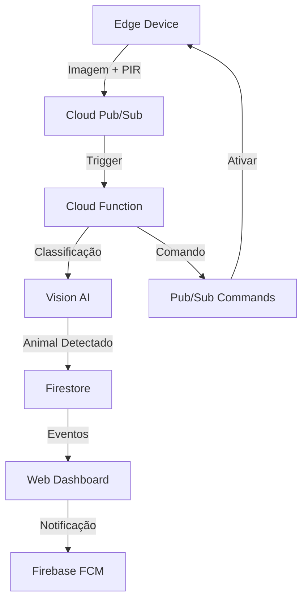

# 🌱 Plant Guardians

Sistema inteligente de proteção de plantações contra invasores animais usando Google Cloud e IoT.

## 📋 Visão Geral

O Plant Guardians é uma solução que combina IoT, visão computacional e atuadores para proteger plantações de forma não-letal contra animais invasores. O sistema detecta automaticamente a presença de animais através de câmeras e sensores PIR, e ativa mecanismos de dissuasão como sons ultrassônicos, luzes estroboscópicas ou sprinklers.

## 🌐 Links de Acesso

- 🔵 **Landing Page Oficial (informativa)**  
  [https://plant-guardians.vercel.app](https://plant-guardians.vercel.app)

- 🟢 **Aplicação Web Interativa (Mock)**  
  [https://plantguardiansystem.netlify.app](https://plantguardiansystem.netlify.app)

## 🧪 Aplicação Interativa (Mock)

Uma versão interativa da aplicação foi publicada em:  
🔗 [https://plantguardiansystem.netlify.app](https://plantguardiansystem.netlify.app)  
Essa versão **não está conectada ao backend nem à infraestrutura na nuvem**, seu objetivo é simular o comportamento da solução final de forma visual e navegável para apresentações e testes de usabilidade.

### Como funciona?

Ao acessar a **Dashboard**, será exibido automaticamente um **popup de alerta** simulando a detecção de um animal (por exemplo, **javali**, **coelho** ou **cervo**). Este comportamento se repete **toda vez que a página inicial (Dashboard) for carregada ou recarregada**.

### Pop-up de Alerta

Cada popup inclui:
- 📸 **Imagem** do animal detectado.
- 📊 **Confiança** na detecção (ex: 85%).
- 💡 **Ação sugerida** (ex: “Espantar animal?”).
- ✅ **Botão "Espantar"**: simula o acionamento de um dissuasor (como luz ou som). Uma notificação verde será exibida no canto superior direito confirmando o sucesso da ação.
- ❌ **Botão "Ignorar"**: nenhuma ação é tomada, e uma notificação azul aparece indicando que a ameaça foi ignorada.

---

### Outras Telas da Aplicação

- 📈 **Dashboard**  
  Exibe os totais de detecções, taxa de sucesso e gráficos com a tendência de detecções por dia.  
  > ⚠️ O pop-up de detecção será disparado automaticamente sempre que esta tela for acessada.

- 📂 **Eventos**  
  Lista todos os eventos de detecção registrados na sessão de uso, com:
  - Imagem do animal
  - Nome da espécie
  - Ação tomada (ex: “Sprinkler ativado”, “Luz estroboscópica”, etc.)
  - Confiança da detecção e horário

- ⚙️ **Configurações**  
  Permite adicionar novas **espécies-alvo** e configurar, de forma simulada:
  - Intensidade do dissuasor (slider)
  - Duração da ação (em segundos)

---

> ✅ Essa versão é ideal para demonstrações, validação com usuários e apresentação do fluxo completo da solução — mesmo sem backend real.

## 🎨 Protótipo Figma

Acesse o protótipo visual do Plant Guardians no Figma:  
[🔗 Ver no Figma](https://www.figma.com/design/axn3DwABzwcnJ97iklYEoH/Plant-Guardians?node-id=0-1&t=Zu792ibCGBHyVK1J-1)



## 🚀 Deploy

### Pré-requisitos

- Google Cloud SDK
- Terraform
- Python 3.12
- Node.js 18+

### Passo a Passo

1. **Clone o repositório:**
   ```sh
   git clone https://github.com/seu-usuario/plant-guardians.git
   cd plant-guardians
   ```
2. **Configure as credenciais do Google Cloud:**
   ```sh
   gcloud auth application-default login
   ```
3. **Aplique a infraestrutura com Terraform:**
   ```sh
   cd infra
   terraform init
   terraform apply
   ```
4. **Deploy do backend:**
   ```sh
   cd backend
   gcloud builds submit --tag gcr.io/seu-projeto/plant-guardians-api
   gcloud run deploy plant-guardians-api --image gcr.io/seu-projeto/plant-guardians-api
   ```
5. **Deploy do frontend:**
   ```sh
   cd web-dashboard
   npm install
   npm run build
   firebase deploy
   ```

## 💰 Estimativa de Custos (Modo Demo)

- Cloud Functions: ~$5/mês (2K invocações)
- Pub/Sub: ~$5/mês (1GB mensagem)
- Vision AI: ~$5/mês (1K imagens)
- Firestore: ~$2/mês (modo "para uso leve")
- Cloud Run: ~$3/mês (mínimo)
- **Total estimado: $20/mês**

## 🔧 Customização do Modelo Vision

1. Acesse o Console do Google Cloud
2. Navegue até Vertex AI > Custom Models
3. Crie um novo dataset com imagens de animais alvo
4. Treine o modelo com as classes específicas
5. Atualize a configuração no Firestore

## 📱 Dashboard

O dashboard web permite:

- Visualização em tempo real de eventos
- Configuração de espécies-alvo
- Ajuste de intensidade dos atuadores
- Estatísticas de detecções
- Notificações push via FCM

## 🧪 Modo Demo com Dados Mockados

Agora o dashboard web pode ser executado em modo demonstração, utilizando apenas dados mockados. Isso permite testar e apresentar todas as funcionalidades do frontend sem necessidade de backend ou autenticação. Basta rodar o frontend normalmente com `npm run dev` na pasta `web-dashboard` e navegar pelas telas, que exibirão dados simulados.

---

## 🖥️ Landing Page

Foi implementada uma landing page moderna e responsiva para apresentação e venda do projeto Plant Guardians. Ela destaca os problemas resolvidos, os diferenciais da solução, depoimentos, formulário de contato e métricas de ROI.  
Acesse a landing page na pasta `landing-page` do projeto e rode com seu servidor local favorito ou publique em seu serviço de hospedagem.

---

## 👥 Participantes

| [<br>Joana<br><sub>Negócios e Inovação</sub>](https://github.com/Joana-Aguiar) | [<br>Guilherme<br><sub>Desenvolvedor</sub>](https://github.com/athena272) | [<br>Francisco<br><sub>Negócios e Inovação</sub>](https://github.com/FranciscoJoseSilva) | [<br>Mônica<br><sub>UX/UI</sub>](https://github.com/MonicaAlvesP) |
|:------------------------------------------------------------------------------------------------------------------------------------------------------------------:|:--------------------------------------------------------------------------------------------------------------------------------------------------:|:----------------------------------------------------------------------------------------------------------------------------------------------------------------------:|:------------------------------------------------------------------------------------------------------------------------------------------------:|

---

## 📄 Licença

Este projeto está sob a licença MIT. Veja o arquivo [LICENSE](LICENSE) para mais detalhes.

---

## 📞 Suporte

Para suporte, envie um email para seu-email@exemplo.com ou abra uma issue no GitHub.

---

<p align="end">
  <br>
  <b>Projeto desenvolvido durante o Hackathon Unicesumar + Google Cloud — Inovação, tecnologia e sustentabilidade no campo.</b>
</p>
