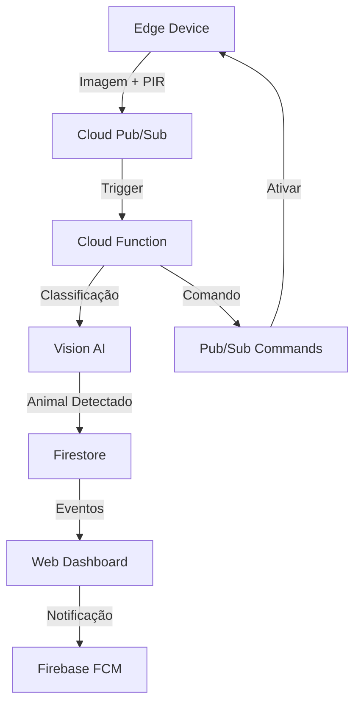

# 🌱 Plant Guardians

Sistema inteligente de proteção de plantações contra invasores animais usando Google Cloud e IoT.

## 📋 Visão Geral

O Plant Guardians é uma solução que combina IoT, visão computacional e atuadores para proteger plantações de forma não-letal contra animais invasores. O sistema detecta automaticamente a presença de animais através de câmeras e sensores PIR, e ativa mecanismos de dissuasão como sons ultrassônicos, luzes estroboscópicas ou sprinklers.



## 🚀 Deploy

### Pré-requisitos
- Google Cloud SDK
- Terraform
- Python 3.12
- Node.js 18+

### Passo a Passo

1. Clone o repositório:
```bash
git clone https://github.com/seu-usuario/plant-guardians.git
cd plant-guardians
```

2. Configure as credenciais do Google Cloud:
```bash
gcloud auth application-default login
```

3. Aplique a infraestrutura com Terraform:
```bash
cd infra
terraform init
terraform apply
```

4. Deploy do backend:
```bash
cd backend
gcloud builds submit --tag gcr.io/seu-projeto/plant-guardians-api
gcloud run deploy plant-guardians-api --image gcr.io/seu-projeto/plant-guardians-api
```

5. Deploy do frontend:
```bash
cd web-dashboard
npm install
npm run build
firebase deploy
```

## 💰 Estimativa de Custos (Modo Demo)

- Cloud Functions: ~$5/mês (2K invocações)
- Pub/Sub: ~$5/mês (1GB mensagem)
- Vision AI: ~$5/mês (1K imagens)
- Firestore: ~$2/mês (modo "para uso leve")
- Cloud Run: ~$3/mês (mínimo)
- **Total estimado: $20/mês**

## 🔧 Customização do Modelo Vision

1. Acesse o Console do Google Cloud
2. Navegue até Vertex AI > Custom Models
3. Crie um novo dataset com imagens de animais alvo
4. Treine o modelo com as classes específicas
5. Atualize a configuração no Firestore

## 📱 Dashboard

O dashboard web permite:
- Visualização em tempo real de eventos
- Configuração de espécies-alvo
- Ajuste de intensidade dos atuadores
- Estatísticas de detecções
- Notificações push via FCM

## 🤝 Contribuindo

1. Fork o projeto
2. Crie sua branch (`git checkout -b feature/AmazingFeature`)
3. Commit suas mudanças (`git commit -m 'Add some AmazingFeature'`)
4. Push para a branch (`git push origin feature/AmazingFeature`)
5. Abra um Pull Request

## 📄 Licença

Este projeto está sob a licença MIT. Veja o arquivo [LICENSE](LICENSE) para mais detalhes.

## 📞 Suporte

Para suporte, envie um email para seu-email@exemplo.com ou abra uma issue no GitHub. 