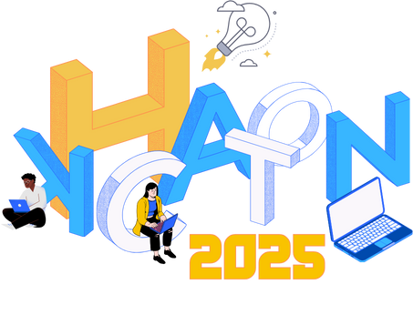

<h1>🌱 Plant Guardians</h1>
🚫 Não-letal. 🌎 Sustentável. 🧠 Inteligente.

<p>Sistema inteligente de proteção de plantações contra invasores animais usando Google Cloud e IoT.</p>

<h2>📋 Visão Geral</h2>

<p>
O Plant Guardians é uma solução que combina IoT, visão computacional e atuadores para proteger plantações de forma não-letal contra animais invasores. O sistema detecta automaticamente a presença de animais através de câmeras e sensores PIR, e ativa mecanismos de dissuasão como sons ultrassônicos, luzes estroboscópicas ou sprinklers.
</p>

<h2>🌐 Acesse Agora</h2>
<p>
Você pode visualizar a versão pública do projeto acessando:<br><br>
<a href="https://plant-guardians.vercel.app/" target="_blank"><strong>🌱 https://plant-guardians.vercel.app/</strong></a>
</p>
<hr/>

> Arquitetura em tempo real baseada em eventos, com escalabilidade nativa na nuvem.
<pre>
<code class="language-mermaid">
graph TD
  A[Edge Device] -->|Imagem + PIR| B[Cloud Pub/Sub]
  B -->|Trigger| C[Cloud Function]
  C -->|Classificação| D[Vision AI]
  D -->|Animal Detectado| E[Firestore]
  C -->|Comando| F[Pub/Sub Commands]
  F -->|Ativar| A
  E -->|Eventos| G[Web Dashboard]
  G -->|Notificação| H[Firebase FCM]
</code>
</pre>

<h2>🚀 Deploy</h2>

<h3>Pré-requisitos</h3>
<ul>
  <li>Google Cloud SDK</li>
  <li>Terraform</li>
  <li>Python 3.12</li>
  <li>Node.js 18+</li>
</ul>

<h3>Passo a Passo</h3>
<ol>
  <li>
  Clone o repositório:
  <pre><code>git clone https://github.com/seu-usuario/plant-guardians.git
cd plant-guardians</code></pre>
  </li>
  <li>
  Configure as credenciais do Google Cloud:
  <pre><code>gcloud auth application-default login</code></pre>
  </li>
  <li>
  Aplique a infraestrutura com Terraform:
  <pre><code>cd infra
terraform init
terraform apply</code></pre>
  </li>
  <li>
  Deploy do backend:
  <pre><code>cd backend
gcloud builds submit --tag gcr.io/seu-projeto/plant-guardians-api
gcloud run deploy plant-guardians-api --image gcr.io/seu-projeto/plant-guardians-api</code></pre>
  </li>
  <li>
  Deploy do frontend:
  <pre><code>cd web-dashboard
npm install
npm run build
firebase deploy</code></pre>
  </li>
</ol>

<h2>💰 Estimativa de Custos (Modo Demo)</h2>
<ul>
  <li>Cloud Functions: ~$5/mês (2K invocações)</li>
  <li>Pub/Sub: ~$5/mês (1GB mensagem)</li>
  <li>Vision AI: ~$5/mês (1K imagens)</li>
  <li>Firestore: ~$2/mês (modo "para uso leve")</li>
  <li>Cloud Run: ~$3/mês (mínimo)</li>
  <li><strong>Total estimado: $20/mês</strong></li>
</ul>

<h2>🔧 Customização do Modelo Vision</h2>
<ol>
  <li>Acesse o Console do Google Cloud</li>
  <li>Navegue até Vertex AI &gt; Custom Models</li>
  <li>Crie um novo dataset com imagens de animais alvo</li>
  <li>Treine o modelo com as classes específicas</li>
  <li>Atualize a configuração no Firestore</li>
</ol>

<h2>📱 Dashboard</h2>
<p>O dashboard web permite:</p>
<ul>
  <li>Visualização em tempo real de eventos</li>
  <li>Configuração de espécies-alvo</li>
  <li>Ajuste de intensidade dos atuadores</li>
  <li>Estatísticas de detecções</li>
  <li>Notificações push via FCM</li>
</ul>

<h2>🧪 Modo Demo com Dados Mockados</h2>
É possível testar todo o dashboard sem backend nem autenticação. Execute:

```sh
npm run dev
```

Simulações de eventos, gráficos e notificações push funcionarão com dados mockados.

---

<h2>🖥️ Landing Page</h2>
<p>
Foi implementada uma landing page moderna e responsiva para apresentação e venda do projeto Plant Guardians. Ela destaca os problemas resolvidos, os diferenciais da solução, depoimentos, formulário de contato e métricas de ROI.<br>
Acesse a landing page na pasta <code>landing-page</code> do projeto e rode com seu servidor local favorito ou publique em seu serviço de hospedagem.
</p>

<hr>

<h2>👥 Participantes</h2>

<table>
  <tr>
    <td align="center">
      <a href="https://github.com/Joana-Aguiar">
        <br>
        Joana<br>
        <sub>Negócios e Inovação</sub>
      </a>
    </td>
    <td align="center">
      <a href="https://github.com/athena272">
        <br>
        Guilherme<br>
        <sub>Desenvolvedor</sub>
      </a>
    </td>
    <td align="center">
      <a href="https://github.com/FranciscoJoseSilva">
        <br>
        Francisco<br>
        <sub>Negócios e Inovação</sub>
      </a>
    </td>
    <td align="center">
      <a href="https://github.com/MonicaAlvesP">
        <br>
        Mônica<br>
        <sub>UX/UI</sub>
      </a>
    </td>
  </tr>
</table>

<hr>

<h2>📄 Licença</h2>
<p>
Este projeto está sob a licença MIT. Veja o arquivo <a href="LICENSE">LICENSE</a> para mais detalhes.
</p>

<h2>📞 Suporte</h2>
<p>
Para suporte, envie um email para seu-email@exemplo.com ou abra uma issue no GitHub.
</p>

...existing code...

<hr>

<p align="end">
  <br>
  <b>Projeto desenvolvido durante o Hackathon Unicesumar + Google Cloud — Inovação, tecnologia e sustentabilidade no campo.</b>
</p>
